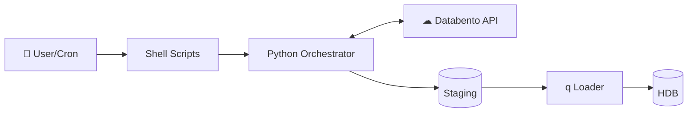
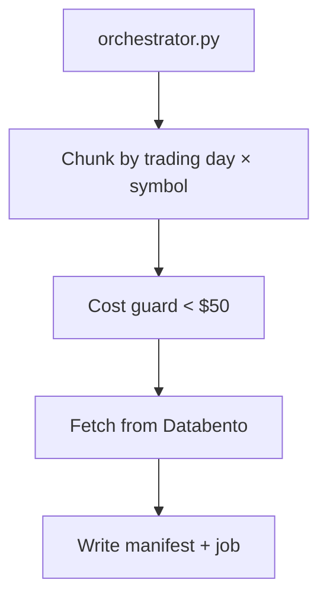
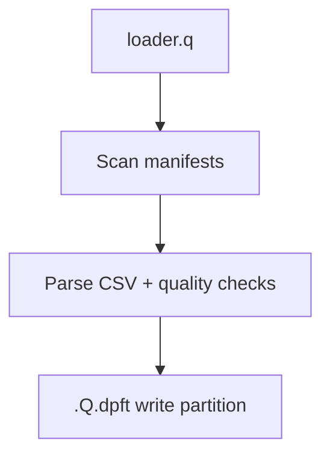
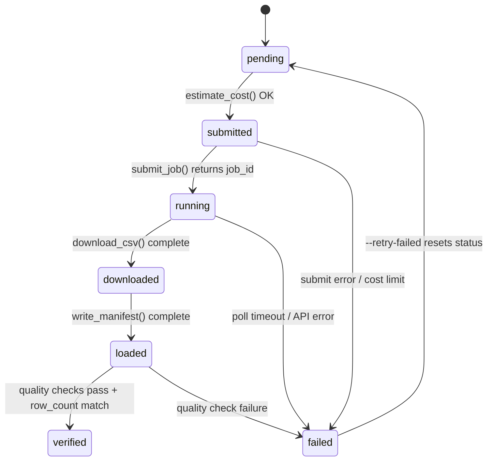

# Architecture

End-to-end data flow from user request to kdb+ HDB partition.

---

## Pipeline Overview

### High-Level Flow


### Detailed Component View

**1. Request Orchestration (Python)**


**2. Data Loading (q)**


**3. Storage Layout**
```
staging/
├── <chunk_id>/              # Raw CSV data; one dir per chunk, named by request+sym+date
│   └── <databento_job_id>/
│       └── *.csv
├── metadata/
│   ├── manifests/           # Load instructions (one JSON per chunk)
│   │   └── archive/         # Verified manifests (moved after successful load)
│   └── backfill_jobs        # Job status tracking (kdb binary table)
├── metrics/                 # Per-chunk timing metrics (one JSON per chunk)
└── reference/               # Corp actions, adj factors, symbology map

hdb/
└── YYYY.MM.DD/              # Partitioned by date
    ├── trades/              # Splayed table; p# sym, g# exchange
    └── ohlcv_1m/
```

**4. Key Scripts**
- **Shell**: `bin/backfill` (CLI entrypoint — sources env, activates venv, calls orchestrator), `bin/monitor` (monitoring dashboard)
- **Python**: `orchestrator.py` (API client, cost control; exposes both CLI and `backfill()` Python API), `metrics.py` (timing), `monitor/app.py` (Flask dashboard)
- **q**: `loader.q`, `manifest.q`, `quality.q`, `jobstore.q`, `adjlib.q`
- **Reference**: `ref_ingest.py`, `ref_tables.q`

---

## Component Responsibilities

### Python Layer

| Component | Responsibility |
|---|---|
| `orchestrator.py` | Trading calendar filtering, chunk generation, cost guard, Databento API calls (submit/poll/download), manifest writing, job store management (batched writes), q loader invocation. Callable via CLI (`bin/backfill`) or Python API (`backfill()`) |
| `metrics.py` | Per-chunk timing across pipeline stages; aggregated `summary.json` per request |

### Staging Directory (Python ↔ q bridge)

All communication between Python and q goes through files on disk. Python never calls q directly except to pipe `runLoader[]` over stdin.

| Path | Written by | Read by |
|---|---|---|
| `<chunk_id>/<job_id>/*.csv` | `download_csv()` | `loadChunkBatch()` |
| `metadata/manifests/*.json` | `write_manifest()` | `processManifests()` |
| `metadata/backfill_jobs` | `JobStore` (via `jobstore.q`) | `JobStore` (via `jobstore.q`) |
| `metrics/<req>/<chunk>.json` | `metrics.py` (stub) | `updateMetrics()` (q fills timing) |
| `reference/symbology_map.csv` | `flushSymbologyMap()` | `ref_tables.q` → `resolveSymbol()` |

### q Loader

| Component | Responsibility |
|---|---|
| `manifest.q` | Scan manifest dir, validate each manifest, check job store for skip/retry |
| `loader.q` | Parse CSVs, validate symbology against `ref_symbology_map`, merge multi-exchange partitions, write HDB via `.Q.dpft`, verify partition row counts post-write, update job records and metrics |
| `quality.q` | Duplicate detection (exchange-aware), time ordering, null checking |

### kdb+ HDB

Partitioned by `date`, splayed tables sorted by `` `sym`time `` within each partition. The `exchange` column identifies the data source. Multiple exchanges coexist in the same partition date; idempotency is exchange-aware.

### Reference Data & Adjustments

| Component | Responsibility |
|---|---|
| `ref_ingest.py` | Fetch real corp actions and dividends via yfinance; compute daily cumulative adjustment factors; called automatically after each backfill. `--synthetic` flag available for CI/offline use. |
| `ref_tables.q` | Load reference CSVs into in-memory tables; `resolveSymbol()` / `resolveInstrumentId()` for point-in-time lookups |
| `adjlib.q` | `applyAdj()` applies split/dividend factors; `getAdjustedClose()` returns OHLCV + `adj_close` in `backward` or `forward` terms with optional `asOf` timestamp for point-in-time factor selection |

### Monitoring Dashboard

| Component | Responsibility |
|---|---|
| `app.py` | Flask web dashboard (default port 8080, override via `MONITOR_PORT`). Serves JSON API endpoints for jobs, metrics, failures, HDB coverage, disk usage, and arbitrary qSQL queries. Can also submit new backfill requests, cancel running jobs, and retry failed chunks. Uses a 3-second TTL cache to avoid spawning q subprocesses on every poll. |
| `hdb_query.py` | Spawns short-lived q subprocesses for HDB inspection: `list_partitions()`, `partition_detail()`, `coverage_matrix()`, `run_query()`. Each query has a 30-second timeout. |
| `templates/index.html` | Single-page dashboard (Bootstrap 5, Chart.js, Plotly) with tabs: Jobs, Submit, Charts, Metrics, Failures, HDB Coverage, qSQL Query, Disk. Auto-refreshes at tab-specific intervals. |

---

## Job Status Lifecycle



---

## Idempotency & Fault Tolerance

- **Pre-flight HDB check**: before submitting any Databento jobs, the orchestrator queries the HDB to identify dates where data for the requested `(schema, exchange)` already exists. Those dates are skipped entirely — no API calls are made and no cost is incurred.
- **Chunk-level idempotency**: each `(date, symbol-batch, exchange)` chunk is independent. A crash in chunk N does not affect chunk N+1.
- **Exchange-aware idempotency**: re-running a load for an already-loaded `(date, exchange)` pair is detected and skipped without re-writing data.
- **Manifest isolation**: when the q loader is invoked, it is passed the `REQUEST_ID` for the current run. `manifest.q` filters to only the manifests for that request ID, preventing concurrent backfill runs that share the same staging directory from loading each other's data.
- **Write locking**: `acquireWriteLock()` uses atomic POSIX `mkdir` to prevent concurrent `.Q.dpft` calls on the same partition. `fcntl.flock` at the Python level serialises q loader invocations across processes on the same host.
- **Atomic writes**: manifest and metrics JSON files write to a `.tmp` file and then `mv` to the final path. Job records are written atomically by kdb's `set` operator on the binary table file.
- **Checksum verification**: on resume after a crash-during-download, the stored SHA-256 is re-verified before skipping the re-download.
