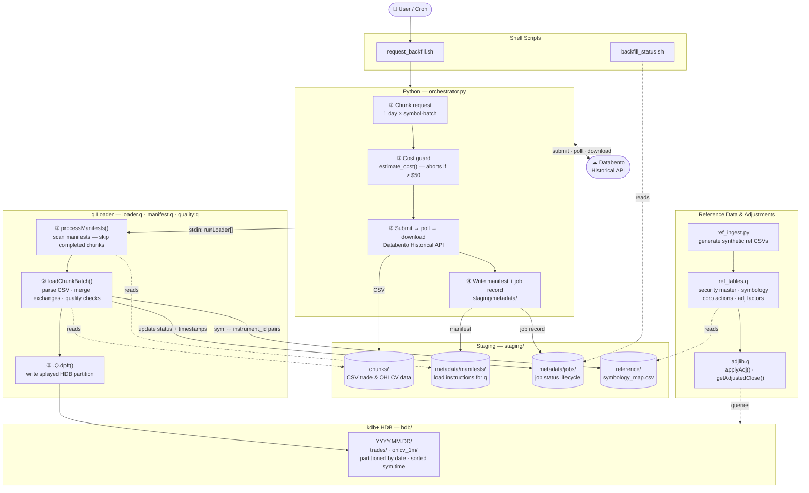
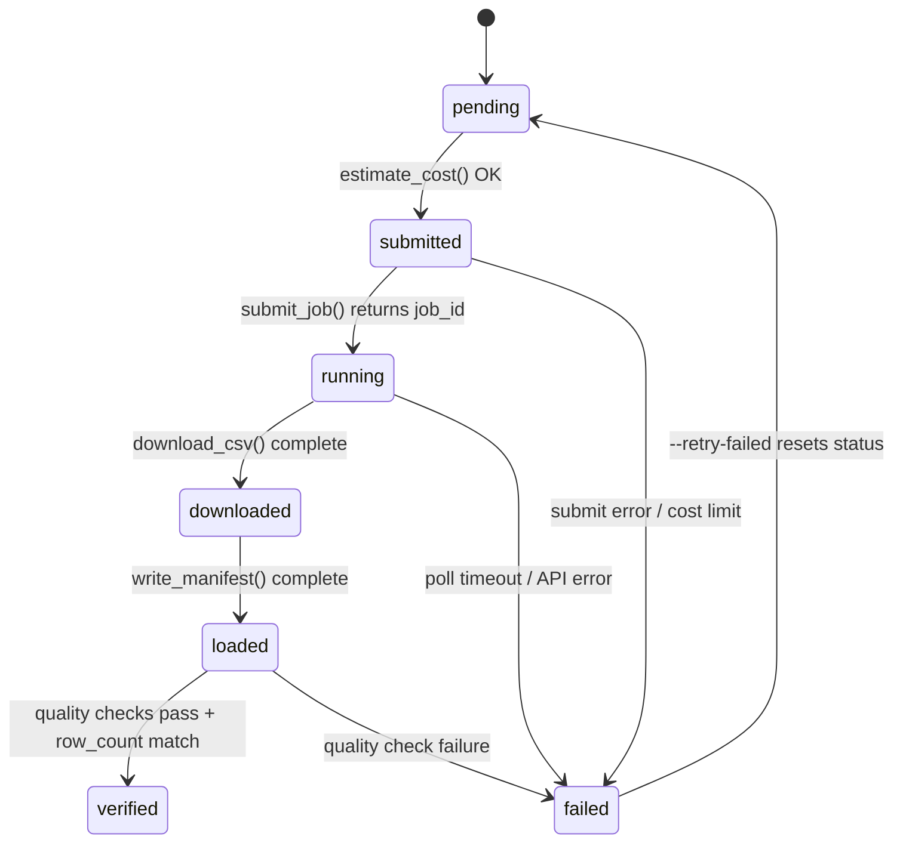

# Architecture

End-to-end data flow from user request to kdb+ HDB partition.

---

## Pipeline Overview

---

## Component Responsibilities

### Python Layer

| Component | Responsibility |
|---|---|
| `orchestrator.py` | Chunk generation, cost guard, Databento API calls (submit/poll/download), manifest writing, job store management, q loader invocation |
| `metrics.py` | Per-chunk timing across pipeline stages; aggregated `summary.json` per request |

### Staging Directory (Python ↔ q bridge)

All communication between Python and q goes through files on disk. Python never calls q directly except to pipe `runLoader[]` over stdin.

| Path | Written by | Read by |
|---|---|---|
| `chunks/<id>/*.csv` | `download_csv()` | `loadChunkBatch()` |
| `metadata/manifests/*.json` | `write_manifest()` | `processManifests()` |
| `metadata/jobs/*.json` | `orchestrator.py` | `updateJobRecord()`, status scripts |
| `metrics/<req>/<chunk>.json` | `metrics.py` (stub) | `updateMetrics()` (q fills timing) |
| `reference/symbology_map.csv` | `flushSymbologyMap()` | `ref_tables.q` → `resolveSymbol()` |

### q Loader

| Component | Responsibility |
|---|---|
| `manifest.q` | Scan manifest dir, validate each manifest, check job store for skip/retry |
| `loader.q` | Parse CSVs, merge multi-exchange partitions, write HDB via `.Q.dpft`, update job records and metrics |
| `quality.q` | Duplicate detection (exchange-aware), time ordering, null checking |

### kdb+ HDB

Partitioned by `date`, splayed tables sorted by `` `sym`time `` within each partition. The `exchange` column identifies the data source. Multiple exchanges coexist in the same partition date; idempotency is exchange-aware.

### Reference Data & Adjustments

| Component | Responsibility |
|---|---|
| `ref_ingest.py` | Generate synthetic security master, corp actions, and adj factor CSVs |
| `ref_tables.q` | Load reference CSVs into in-memory tables; `resolveSymbol()` / `resolveInstrumentId()` for point-in-time lookups |
| `adjlib.q` | `applyAdj()` applies split/dividend factors; `getAdjustedClose()` returns OHLCV + `adj_close` column in `backward` (post-split) or `forward` (pre-split) terms |

---

## Job Status Lifecycle

---

## Idempotency & Fault Tolerance

- **Chunk-level idempotency**: each `(date, symbol-batch, exchange)` chunk is independent. A crash in chunk N does not affect chunk N+1.
- **Exchange-aware idempotency**: re-running a load for an already-loaded `(date, exchange)` pair is detected and skipped without re-writing data.
- **Write locking**: `acquireWriteLock()` uses atomic POSIX `mkdir` to prevent concurrent `.Q.dpft` calls on the same partition.
- **Atomic writes**: all JSON updates (job records, metrics, manifests) write to a `.tmp` file and then `mv` to the final path.
- **Checksum verification**: on resume after a crash-during-download, the stored SHA-256 is re-verified before skipping the re-download.
